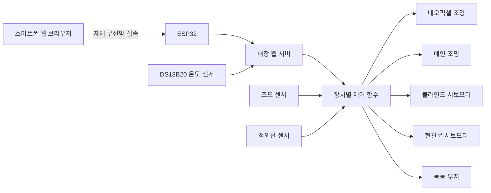
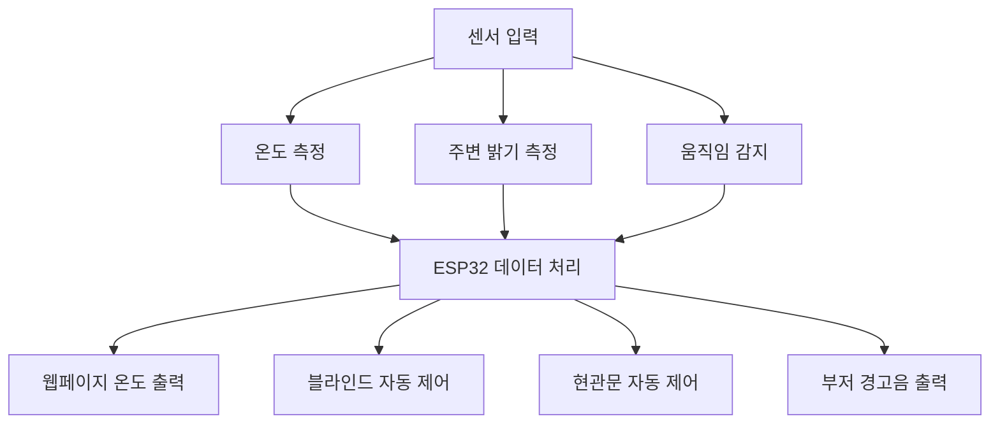
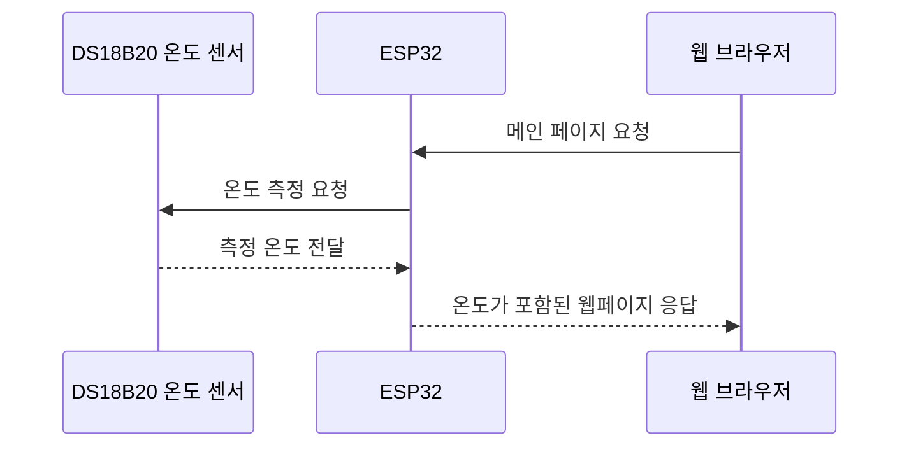
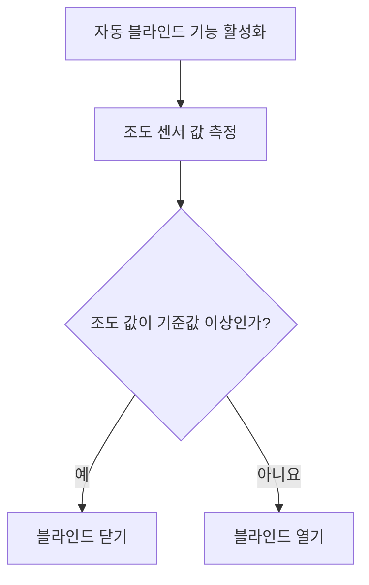
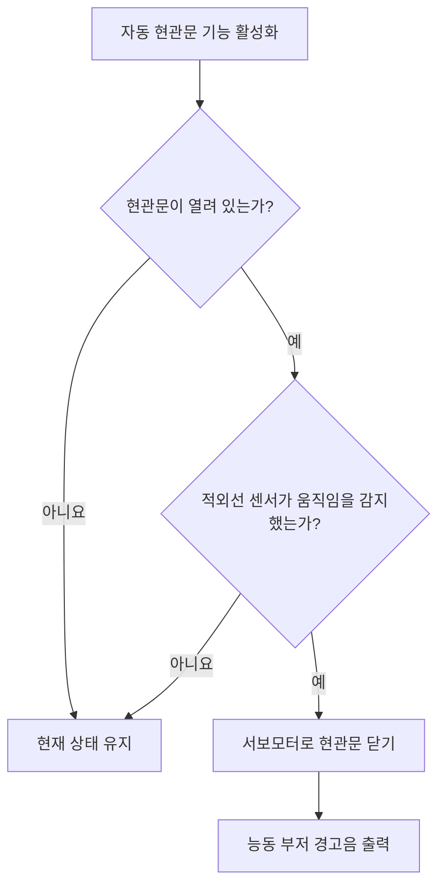
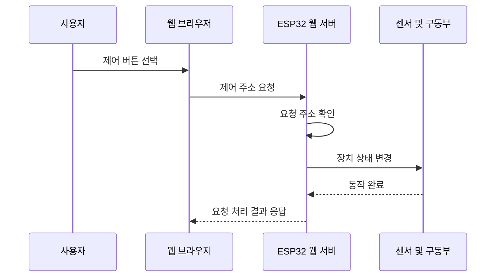

# ESP32 기반 웹 제어 스마트홈

> **2023 국립안동대학교 전교생 해커톤 우수상 수상작**  
> ESP32의 자체 무선망과 웹 서버를 활용하여 스마트폰 웹 브라우저에서 조명, 블라인드, 현관문을 제어할 수 있도록 제작한 스마트홈 시제품입니다.

<p align="center">
  
</p>

---

## 프로젝트 정보

| 구분 | 내용 |
|---|---|
| 프로젝트명 | ESP32 기반 웹 제어 스마트홈 |
| 참가 행사 | 2023 국립안동대학교 전교생 해커톤 |
| 수상 내역 | 우수상 |
| 개발 기간 | 2023년 |
| 개발 형태 | 4인 팀 프로젝트 |
| 개발 분야 | 임베디드 시스템, 사물인터넷, 웹 기반 하드웨어 제어 |
| 핵심 장치 | ESP32 |
| 담당 역할 | 납땜, 회로 설계, 배선, 스마트홈 모형 제작 |

---

## 프로젝트 소개

본 프로젝트는 ESP32와 다양한 센서 및 구동부를 활용하여 제작한 스마트홈 시제품입니다.

ESP32가 자체적으로 무선망과 웹 서버를 생성하며, 사용자는 스마트폰이나 컴퓨터의 웹 브라우저를 통해 스마트홈 제어 페이지에 접속할 수 있습니다.

별도의 외부 서버나 공유기 없이 ESP32 내부에서 웹페이지 제공과 장치 제어가 이루어지도록 구현했습니다.

### 구현 기능

- 실내 온도 측정 및 웹페이지 표시
- 네오픽셀 조명 색상 제어
- 메인 조명 밝기 단계 제어
- 블라인드 열기 및 닫기
- 조도 센서 기반 자동 블라인드
- 현관문 열기 및 닫기
- 적외선 센서 기반 자동 현관문
- 움직임 감지 시 부저 경고음 출력

---

## 프로젝트 개발 배경

스마트홈 기술을 활용하여 사용자의 생활 편의성과 안전성을 높이는 것을 목표로 프로젝트를 진행했습니다.

특히 별도의 프로그램을 설치하지 않고 웹 브라우저만으로 집 안의 장치를 제어할 수 있도록 구성했습니다.

### 주요 목표

- 거동이 불편한 사용자의 생활 편의성 향상
- 웹 브라우저를 이용한 간편한 장치 제어
- 조도 센서를 활용한 자동 블라인드 구현
- 적외선 센서를 활용한 출입 감지 기능 구현
- 센서와 구동부를 결합한 임베디드 시스템 제작
- 실제 동작 가능한 스마트홈 모형 완성

---

## 시제품 사진

<table>
  <tr>
    <td align="center">
      
      <br>
      <b>스마트홈 전체 구성</b>
    </td>
    <td align="center">
      
      <br>
      <b>온도 센서 및 웹페이지 출력</b>
    </td>
  </tr>
  <tr>
    <td align="center">
      
      <br>
      <b>조도 센서 기반 자동 블라인드</b>
    </td>
    <td align="center">
      
      <br>
      <b>적외선 센서 기반 자동 현관문</b>
    </td>
  </tr>
</table>

---

## 전체 시스템 구조



---

## 하드웨어 동작 구조



---

## 핵심 기능

### 실내 온도 확인

DS18B20 온도 센서를 이용하여 스마트홈 내부의 온도를 측정합니다.

측정한 온도 값은 ESP32 웹 서버가 생성한 웹페이지에 표시됩니다.

<p align="center">
  
</p>

### 동작 과정



---

### 네오픽셀 조명 제어

네오픽셀 발광 다이오드를 이용하여 실내 분위기 조명을 구현했습니다.

웹페이지의 버튼을 통해 조명의 색상을 변경하거나 끌 수 있습니다.

| 웹페이지 기능 | 조명 동작 |
|---|---|
| 조명 끄기 | 네오픽셀 전체 끄기 |
| 흰색 | 흰색 조명 출력 |
| 빨간색 | 빨간색 조명 출력 |
| 초록색 | 초록색 조명 출력 |
| 파란색 | 파란색 조명 출력 |

---

### 메인 조명 밝기 제어

네 개의 발광 다이오드를 이용하여 스마트홈 내부의 메인 조명을 구현했습니다.

펄스 폭 변조 값을 조절하여 조명의 밝기를 네 단계로 제어합니다.

| 밝기 단계 | 듀티 값 |
|---|---:|
| 꺼짐 | 0 |
| 약한 밝기 | 85 |
| 중간 밝기 | 170 |
| 최대 밝기 | 255 |


---

### 자동 블라인드

서보모터와 조도 센서를 이용하여 블라인드를 제어합니다.

웹페이지에서 블라인드를 직접 열거나 닫을 수 있으며, 자동 기능을 활성화하면 조도 센서 값에 따라 블라인드가 동작합니다.

<p align="center">
  
</p>

### 자동 블라인드 동작



### 지원 기능

- 블라인드 열기
- 블라인드 닫기
- 자동 블라인드 기능 켜기
- 자동 블라인드 기능 끄기

---

### 자동 현관문과 경고 기능

서보모터를 이용하여 스마트홈의 현관문을 제어합니다.

웹페이지에서 현관문을 직접 열고 닫을 수 있으며, 자동 기능이 활성화된 상태에서 적외선 센서가 움직임을 감지하면 문을 닫고 부저를 작동합니다.

<p align="center">
  
</p>

### 자동 현관문 동작



---

## 웹페이지 제어 구조

웹페이지에서 버튼을 누르면 자바스크립트가 ESP32 웹 서버에 요청을 전송합니다.

ESP32는 요청받은 주소에 연결된 처리 함수를 실행하여 발광 다이오드, 서보모터, 부저 등의 상태를 변경합니다.

<p align="center">
  
</p>



---

## 웹 서버 요청 주소

| 기능 | 요청 주소 |
|---|---|
| 메인 페이지 및 온도 표시 | `/` |
| 흰색 조명 | `/white_on` |
| 빨간색 조명 | `/red_on` |
| 초록색 조명 | `/green_on` |
| 파란색 조명 | `/blue_on` |
| 네오픽셀 끄기 | `/rgb_off` |
| 메인 조명 끄기 | `/led_on_0` |
| 메인 조명 33% | `/led_on_85` |
| 메인 조명 66% | `/led_on_170` |
| 메인 조명 100% | `/led_on_255` |
| 블라인드 열기 | `/blind_on` |
| 블라인드 닫기 | `/blind_off` |
| 자동 블라인드 켜기 | `/blind_on_light` |
| 자동 블라인드 끄기 | `/blind_off_light` |
| 현관문 열기 | `/door_open` |
| 현관문 닫기 | `/door_close` |
| 자동 현관문 켜기 | `/door_ir_on` |
| 자동 현관문 끄기 | `/door_ir_off` |

---

## 사용 기술

### 개발 환경

- 아두이노 통합 개발 환경
- ESP32 보드 환경
- 아두이노 기반 C/C++
- HTML
- CSS
- 자바스크립트
- ESP32 내장 웹 서버
- ESP32 자체 무선망 모드

### 사용 라이브러리

| 라이브러리 | 사용 목적 |
|---|---|
| ESP32Servo | 서보모터 제어 |
| OneWire | 온도 센서 통신 |
| DallasTemperature | DS18B20 온도 측정 |
| WiFi | ESP32 무선망 생성 |
| WebServer | 웹 서버 및 요청 주소 처리 |
| Adafruit NeoPixel | 네오픽셀 조명 제어 |

---

## 하드웨어 구성

| 부품 | 사용 목적 |
|---|---|
| ESP32 | 전체 시스템 제어 및 웹 서버 운영 |
| DS18B20 온도 센서 | 실내 온도 측정 |
| 조도 센서 | 주변 밝기 측정 |
| 적외선 센서 | 움직임 감지 |
| 서보모터 2개 | 블라인드 및 현관문 제어 |
| 네오픽셀 | 실내 분위기 조명 |
| 발광 다이오드 4개 | 메인 조명 |
| 능동 부저 | 움직임 감지 경고음 |
| 스마트홈 모형 | 센서와 구동부 설치 및 시연 |

---

## ESP32 핀 구성

| 부품 | 핀 번호 |
|---|---:|
| 메인 발광 다이오드 1 | 15 |
| 메인 발광 다이오드 2 | 2 |
| 메인 발광 다이오드 3 | 4 |
| 메인 발광 다이오드 4 | 5 |
| 네오픽셀 | 18 |
| DS18B20 온도 센서 | 19 |
| 블라인드 서보모터 | 21 |
| 현관문 서보모터 | 14 |
| 조도 센서 | 35 |
| 적외선 센서 | 26 |
| 능동 부저 | 13 |

---

## 담당 역할

### 백주원

- 스마트홈 회로 설계 참여
- 센서와 구동부 배선
- 전자부품 납땜
- 스마트홈 모형 제작
- 하드웨어 부품 배치 및 조립
- 센서와 구동부가 설치되는 물리적 구조 구현

본 프로젝트에서는 회로 설계와 납땜, 배선, 스마트홈 모형 제작을 담당했습니다.

센서와 서보모터, 발광 다이오드, 부저가 실제 시제품에서 동작할 수 있도록 하드웨어 구조를 제작하며 임베디드 시스템의 물리적 구현 과정을 경험했습니다.

---

## 팀 구성

| 팀원 | 담당 역할 |
|---|---|
| 장xx | ESP32 제어, 웹페이지 구현, 회로 설계, 발표자료 제작 |
| 김xx | 코딩 보조, 회로 설계, 발표자료 제작, 작품 제작 |
| 이xx | 아이디어 제안, 회로 설계, 작품 제작 |
| 백주원 | 납땜, 회로 설계, 작품 제작 |

---

## 실행 방법

### 개발 환경 준비

아두이노 통합 개발 환경에 ESP32 보드 패키지를 설치합니다.

다음 라이브러리를 설치합니다.

- ESP32Servo
- OneWire
- DallasTemperature
- Adafruit NeoPixel

### 무선망 설정

소스 코드의 무선망 이름과 비밀번호를 설정합니다.

```text
무선망 이름: 사용할 이름
무선망 비밀번호: 사용할 비밀번호
```

### ESP32 업로드

1. ESP32를 컴퓨터에 연결합니다.
2. 아두이노 통합 개발 환경에서 ESP32 보드를 선택합니다.
3. 연결된 통신 포트를 선택합니다.
4. `src/smart_home.ino` 파일을 ESP32에 업로드합니다.

### 웹페이지 접속

1. 스마트폰 또는 컴퓨터의 무선망 설정을 엽니다.
2. ESP32가 생성한 무선망에 접속합니다.
3. 웹 브라우저 주소창에 다음 주소를 입력합니다.

```text
192.168.1.1
```

4. 표시된 웹페이지에서 스마트홈 기능을 제어합니다.

---

## 저장소 구조

```text
.
├── README.md
├── src
│   └── smart_home.ino
└── docs
    ├── Hackerton.pdf
    └── images
        ├── project-overview.png
        ├── temperature-monitoring.png
        ├── auto-blind.png
        ├── auto-door.png
        └── web-control-flow.png
```

---

## 개발 결과

- ESP32 자체 무선망 구축
- ESP32 내부 웹 서버 구현
- 웹 브라우저 기반 스마트홈 제어
- 실내 온도 측정 및 웹페이지 표시
- 네오픽셀 색상 제어
- 메인 조명 밝기 단계 제어
- 조도 센서 기반 자동 블라인드 구현
- 적외선 센서 기반 자동 현관문 구현
- 움직임 감지 시 부저 경고 기능 구현
- 실제 동작 가능한 스마트홈 모형 제작
- 2023 국립안동대학교 전교생 해커톤 우수상 수상

---

## 기술적 회고

### 잘된 점

- 별도의 외부 서버 없이 ESP32에서 웹 서버를 운영했습니다.
- 별도의 공유기 없이 ESP32 자체 무선망으로 시연 환경을 구성했습니다.
- 센서 입력과 구동부 출력을 하나의 스마트홈 시제품으로 통합했습니다.
- 웹페이지에서 여러 장치를 직접 제어할 수 있도록 구현했습니다.
- 수동 제어와 센서 기반 자동 제어 기능을 함께 구현했습니다.
- 제한된 해커톤 기간 안에 실제 작동하는 시제품을 완성했습니다.
- 회로 설계부터 납땜, 배선, 모형 제작까지 하드웨어 제작 과정을 경험했습니다.

### 개선할 점

- 반복 지연 처리를 비차단 방식으로 변경
- 웹페이지와 장치 제어 코드를 기능별로 분리
- 무선망 설정값을 별도의 설정 파일로 관리
- 웹페이지 디자인과 모바일 화면 배치 개선
- 사용자 인증 및 접근 제어 기능 추가
- 센서 기준값을 웹페이지에서 변경할 수 있도록 개선
- 온도 및 출입 기록 저장 기능 추가
- 센서 오류와 연결 오류에 대한 예외 처리 추가
- 실제 주택 환경에 적용할 수 있는 전원 보호 회로 추가
- 여러 ESP32 장치를 통합 관리할 수 있는 구조로 확장

---

## 프로젝트를 통해 얻은 경험

- ESP32를 이용한 임베디드 시스템 제작
- 센서와 구동부의 회로 연결
- 전자부품 납땜과 배선
- 서보모터와 발광 다이오드 제어 구조 이해
- 웹 서버와 실제 하드웨어의 연결 구조 이해
- 센서 값에 따른 자동 제어 방식 이해
- 스마트홈 모형 설계 및 제작
- 팀원 간 역할 분담과 협업
- 제한된 시간 안에 작동 가능한 시제품을 완성한 경험

---

## 관련 자료

- [원본 소스 코드](src/smart_home.ino)
- [해커톤 발표자료](docs/Hackerton.pdf)

---

## 수상 내역

### 2023 국립안동대학교 전교생 해커톤 우수상

ESP32와 센서, 서보모터, 발광 다이오드, 부저를 활용하여 웹 브라우저로 제어할 수 있는 스마트홈 시제품을 제작했습니다.
