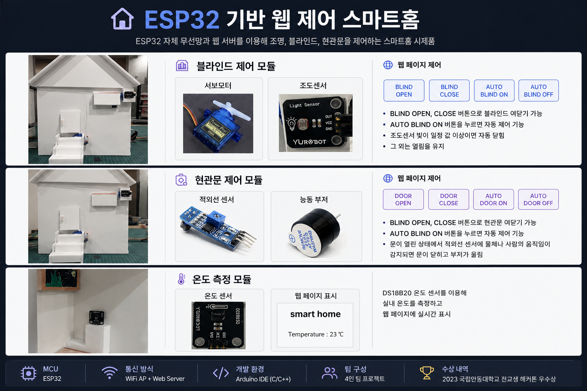
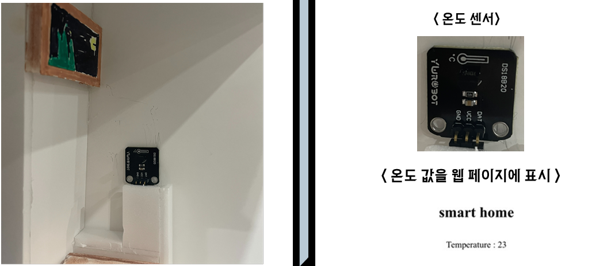
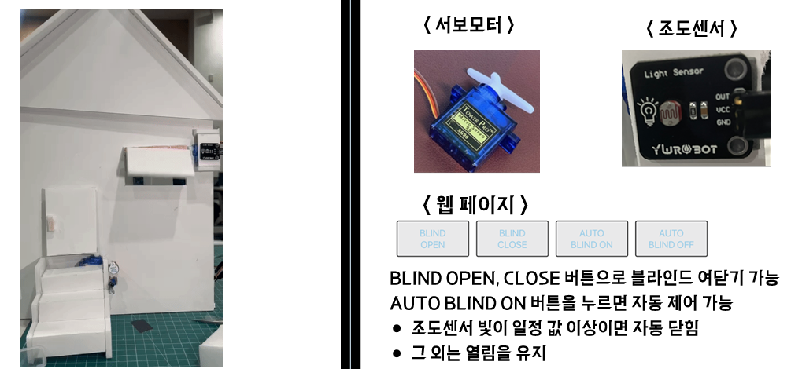
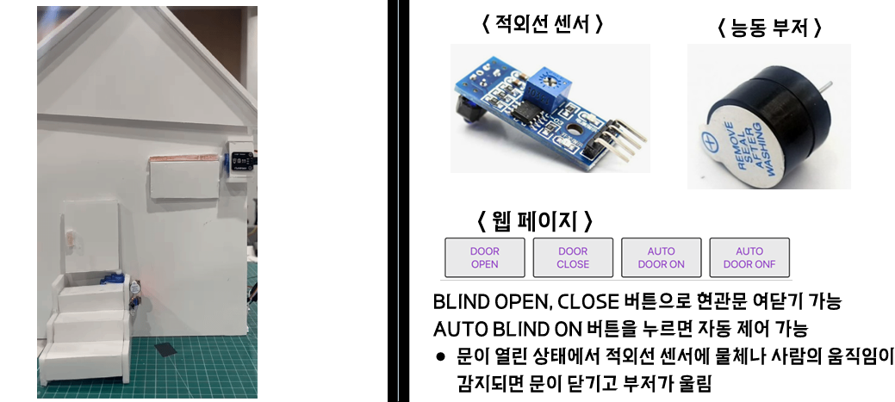
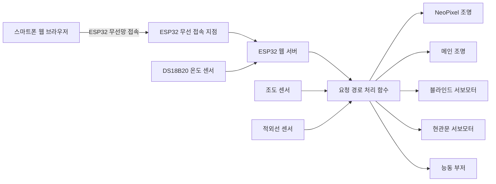
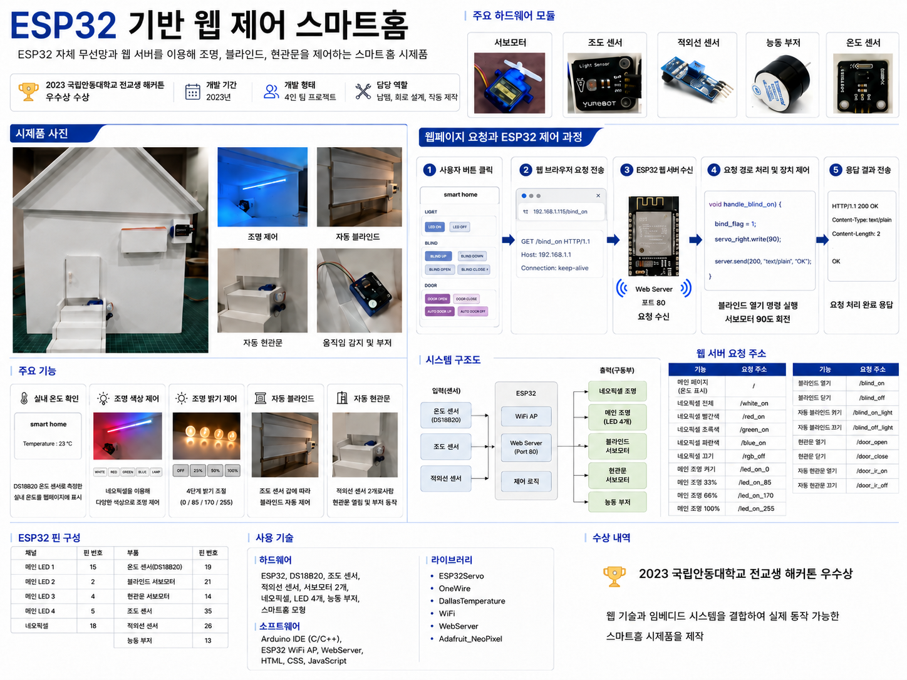

# ESP32 기반 웹 제어 스마트홈

> **2023 국립안동대학교 전교생 해커톤 우수상 수상작**  
> ESP32가 자체 무선망과 웹 서버를 생성하고, 스마트폰 웹 브라우저를 통해 조명·블라인드·현관문을 제어하는 사물인터넷 스마트홈 시제품입니다.

<p align="center">
  
</p>

---

## 프로젝트 개요

| 항목 | 내용 |
|---|---|
| 프로젝트명 | ESP32 기반 웹 제어 스마트홈 |
| 참가 행사 | 2023 국립안동대학교 전교생 해커톤 |
| 수상 내역 | 우수상 |
| 개발 형태 | 4인 팀 프로젝트 |
| 개발 분야 | 임베디드 시스템, 사물인터넷, 웹 기반 장치 제어 |
| 핵심 제어 장치 | ESP32 |
| 개발 기간 | 2023년 |
| 담당 역할 | 납땜, 회로 설계, 스마트홈 모형 및 하드웨어 제작 |

본 프로젝트는 별도의 공유기나 외부 서버 없이 ESP32가 무선 접속 지점과 웹 서버 역할을 동시에 수행하도록 구현한 스마트홈 시제품입니다.

사용자는 스마트폰을 ESP32가 생성한 무선망에 연결한 뒤, 웹페이지를 통해 다음 기능을 사용할 수 있습니다.

- 실내 온도 확인
- RGB 분위기 조명 제어
- 메인 조명 밝기 제어
- 블라인드 수동 및 자동 제어
- 현관문 수동 및 자동 제어
- 움직임 감지 및 경고음 출력

---

## 프로젝트 개발 배경

스마트홈 기술을 활용하여 사용자의 생활 편의성과 안전성을 향상하는 것을 목표로 프로젝트를 진행했습니다.

특히 스마트폰 웹 브라우저만으로 집 안의 여러 장치를 제어할 수 있도록 구성하여 별도의 전용 응용 프로그램 설치 없이 사용할 수 있도록 했습니다.

주요 개발 목적은 다음과 같습니다.

- 거동이 불편한 사용자의 생활 편의성 향상
- 1인 가구 증가에 따른 원격 제어 기능 제공
- 조도 센서를 활용한 자동 제어와 에너지 절감
- 출입 감지 기능을 통한 안전성과 보안성 향상
- 웹 기술과 임베디드 시스템을 결합한 사물인터넷 구현

---

## 핵심 기능

### 실내 온도 확인

DS18B20 온도 센서를 이용하여 실내 온도를 측정합니다.

측정된 온도 데이터는 ESP32 웹 서버를 통해 스마트폰 웹페이지에 표시됩니다.

<p align="center">
  
</p>

---

### RGB 분위기 조명 제어

NeoPixel 발광 다이오드를 이용하여 실내 분위기 조명을 구현했습니다.

웹페이지의 버튼을 통해 다음 색상을 선택할 수 있습니다.

- 흰색
- 빨간색
- 초록색
- 파란색
- 조명 끄기

각 버튼을 누르면 웹 브라우저가 ESP32 웹 서버에 요청을 전송하고, 해당 요청에 맞는 발광 다이오드 색상이 출력됩니다.

---

### 메인 조명 밝기 제어

네 개의 발광 다이오드에 펄스 폭 변조 값을 적용하여 메인 조명의 밝기를 조절합니다.

| 밝기 단계 | 듀티 값 | 웹페이지 버튼 |
|---|---:|---|
| 꺼짐 | 0 | LED OFF |
| 33% | 85 | LED ON 33% |
| 66% | 170 | LED ON 66% |
| 100% | 255 | LED ON 100% |

사용자는 웹페이지에서 원하는 밝기 단계를 선택할 수 있습니다.

---

### 자동 블라인드 제어

서보모터를 이용하여 블라인드를 열고 닫을 수 있도록 구현했습니다.

수동 제어뿐만 아니라 조도 센서를 활용한 자동 제어 기능도 제공합니다.

- 블라인드 열기
- 블라인드 닫기
- 자동 블라인드 기능 켜기
- 자동 블라인드 기능 끄기

자동 제어 모드에서는 조도 센서 값에 따라 블라인드 상태가 결정됩니다.

```text
조도 센서 값이 기준값 이상
→ 블라인드 닫기

조도 센서 값이 기준값 미만
→ 블라인드 열기
```

<p align="center">
  
</p>

---

### 자동 현관문 및 경고 기능

서보모터를 이용하여 현관문을 열고 닫을 수 있도록 구현했습니다.

수동 제어와 적외선 센서를 이용한 자동 제어 기능을 함께 제공합니다.

- 현관문 열기
- 현관문 닫기
- 자동 현관문 기능 켜기
- 자동 현관문 기능 끄기

자동 제어 모드에서 현관문이 열린 상태로 움직임이 감지되면 다음 동작을 수행합니다.

```text
적외선 센서가 움직임 감지
→ 현관문 닫기
→ 능동 부저 경고음 출력
```

<p align="center">
  
</p>

---

## 시스템 구조



---

## 웹 제어 처리 과정

웹페이지의 버튼을 누르면 자바스크립트가 ESP32 웹 서버에 요청을 전송합니다.

ESP32는 요청받은 경로에 등록된 처리 함수를 실행하고 연결된 센서와 구동부를 제어합니다.

```text
사용자가 웹페이지 버튼 클릭
            ↓
자바스크립트 XMLHttpRequest 실행
            ↓
ESP32 웹 서버에 GET 요청 전송
            ↓
요청 경로에 등록된 처리 함수 실행
            ↓
발광 다이오드·서보모터·부저 제어
```

<p align="center">
  
</p>

---

## 웹 서버 요청 경로

| 기능 | 요청 경로 |
|---|---|
| 메인 페이지 및 온도 표시 | `/` |
| 흰색 RGB 조명 | `/white_on` |
| 빨간색 RGB 조명 | `/red_on` |
| 초록색 RGB 조명 | `/green_on` |
| 파란색 RGB 조명 | `/blue_on` |
| RGB 조명 끄기 | `/rgb_off` |
| 메인 조명 끄기 | `/led_on_0` |
| 메인 조명 33% | `/led_on_85` |
| 메인 조명 66% | `/led_on_170` |
| 메인 조명 100% | `/led_on_255` |
| 블라인드 열기 | `/blind_on` |
| 블라인드 닫기 | `/blind_off` |
| 자동 블라인드 켜기 | `/blind_on_light` |
| 자동 블라인드 끄기 | `/blind_off_light` |
| 현관문 열기 | `/door_open` |
| 현관문 닫기 | `/door_close` |
| 자동 현관문 켜기 | `/door_ir_on` |
| 자동 현관문 끄기 | `/door_ir_off` |

---

## 사용 기술

### 하드웨어

- ESP32 개발 보드
- DS18B20 온도 센서
- 조도 센서
- 적외선 센서
- 서보모터 2개
- NeoPixel 발광 다이오드
- 일반 발광 다이오드 4개
- 능동 부저
- 스마트홈 모형
- 브레드보드 및 연결 배선

### 소프트웨어

- 아두이노 기반 C/C++
- ESP32 무선 접속 지점 모드
- ESP32 내장 웹 서버
- HTML
- CSS
- 자바스크립트
- XMLHttpRequest
- 센서 입력 처리
- 구동부 출력 제어

### 사용 라이브러리

```cpp
#include <ESP32Servo.h>
#include <OneWire.h>
#include <DallasTemperature.h>
#include <WiFi.h>
#include <WebServer.h>
#include <Adafruit_NeoPixel.h>
```

---

## 하드웨어 핀 구성

| 부품 | ESP32 핀 |
|---|---:|
| 메인 발광 다이오드 1 | 15 |
| 메인 발광 다이오드 2 | 2 |
| 메인 발광 다이오드 3 | 4 |
| 메인 발광 다이오드 4 | 5 |
| NeoPixel 발광 다이오드 | 18 |
| DS18B20 온도 센서 | 19 |
| 블라인드 서보모터 | 21 |
| 현관문 서보모터 | 14 |
| 조도 센서 | 35 |
| 적외선 센서 | 26 |
| 능동 부저 | 13 |

---

## 주요 코드 구조

### ESP32 무선 접속 지점 생성

ESP32가 자체 무선망을 생성하도록 설정했습니다.

```cpp
WiFi.mode(WIFI_AP);
WiFi.softAP(ssid, pw);
WiFi.softAPConfig(ip, gw, sb);
```

이를 통해 외부 공유기가 없는 환경에서도 스마트폰과 ESP32가 직접 통신할 수 있습니다.

---

### 웹 서버 경로 등록

각 기능에 해당하는 요청 경로와 처리 함수를 연결했습니다.

```cpp
server.on("/", handle_root);

server.on("/white_on", HTTP_GET, handle_white_on);
server.on("/red_on", HTTP_GET, handle_red_on);
server.on("/green_on", HTTP_GET, handle_green_on);
server.on("/blue_on", HTTP_GET, handle_blue_on);
server.on("/rgb_off", HTTP_GET, handle_rgb_off);

server.on("/blind_on", HTTP_GET, handle_blind_on);
server.on("/blind_off", HTTP_GET, handle_blind_off);
server.on("/blind_on_light", HTTP_GET, handle_blind_on_light);
server.on("/blind_off_light", HTTP_GET, handle_blind_off_light);

server.on("/door_open", HTTP_GET, handle_door_open);
server.on("/door_close", HTTP_GET, handle_door_close);
server.on("/door_ir_on", HTTP_GET, handle_door_ir_on);
server.on("/door_ir_off", HTTP_GET, handle_door_ir_off);
```

---

### 자동 블라인드 제어

조도 센서 값을 읽고 기준값에 따라 서보모터의 각도를 변경합니다.

```cpp
void servo_light_on()
{
    light_val = analogRead(light);

    if (light_val >= 3000)
    {
        servo_light.write(0);
    }
    else
    {
        servo_light.write(90);
    }
}
```

---

### 메인 조명 밝기 제어

펄스 폭 변조 값을 이용하여 발광 다이오드의 밝기를 제어합니다.

```cpp
void led_on(int duty)
{
    int x;

    for (x = 0; x < 4; x = x + 1)
    {
        analogWrite(led[x], duty);
    }
}
```

---

### 적외선 센서 기반 현관문 제어

자동 현관문 기능이 활성화된 상태에서 움직임이 감지되면 문을 닫고 부저를 작동합니다.

```cpp
if (door_control == 1 &&
    door_flag == 1 &&
    digitalRead(irPin) == 0)
{
    door_flag = 2;
    buzzer_on = 1;
}
```

---

## 담당 역할 및 기여

### 백주원

- 스마트홈 회로 설계 참여
- 센서와 구동부 배선 작업
- 부품 납땜 및 하드웨어 연결
- 스마트홈 모형 제작
- 작품의 물리적 구조 설계 및 조립
- 소프트웨어와 실제 장치가 연결되도록 하드웨어 통합 작업 수행
- 센서와 서보모터, 발광 다이오드, 부저의 동작 확인 및 수정

본 프로젝트에서는 단순한 모형 제작을 넘어 프로그램의 출력이 실제 장치 동작으로 연결되도록 회로와 구조물을 통합했습니다.

이를 통해 센서 입력, 마이크로컨트롤러 제어, 구동부 출력으로 이어지는 임베디드 시스템의 전체 동작 과정을 경험했습니다.

---

## 팀 구성

| 팀원 | 담당 역할 |
|---|---|
| 장지원 | ESP32 제어, 웹페이지 구현, 회로 설계, 발표자료 제작 |
| 김수빈 | 코딩 보조, 회로 설계, 발표자료 제작, 작품 제작 |
| 이호진 | 아이디어 제안, 회로 설계, 작품 제작 |
| 백주원 | 납땜, 회로 설계, 작품 제작 |

---

## 실행 방법

### 개발 환경 준비

아두이노 통합 개발 환경에 ESP32 보드 패키지를 설치합니다.

다음 라이브러리를 설치합니다.

- ESP32Servo
- OneWire
- DallasTemperature
- Adafruit NeoPixel

`src/smart_home.ino` 파일을 아두이노 통합 개발 환경에서 엽니다.

---

### 무선망 정보 설정

소스 코드의 무선망 이름과 비밀번호를 설정합니다.

```cpp
const char* ssid = "SMART_HOME";
const char* pw = "사용할 비밀번호";
```

---

### ESP32 업로드

ESP32 보드를 컴퓨터에 연결한 뒤 보드와 포트를 설정합니다.

코드를 컴파일하고 ESP32에 업로드합니다.

---

### 스마트홈 접속

스마트폰의 무선망 설정에서 ESP32가 생성한 무선망에 접속합니다.

웹 브라우저 주소창에 다음 주소를 입력합니다.

```text
192.168.1.1
```

웹페이지가 표시되면 각 버튼을 이용하여 스마트홈 장치를 제어할 수 있습니다.

---

## 저장소 구조

```text
.
├── README.md
├── src
│   └── smart_home.ino
└── docs
    ├── Hackerton.pdf
    └── images
        ├── project-overview.png
        ├── temperature-monitoring.png
        ├── auto-blind.png
        ├── auto-door.png
        └── web-control-flow.png
```

---

## 개발 결과

- ESP32 자체 무선망 구축
- 스마트폰 웹 브라우저 기반 장치 제어 구현
- 실시간 온도 정보 표시
- NeoPixel RGB 조명 제어
- 메인 조명 밝기 단계 제어
- 조도 센서 기반 자동 블라인드 구현
- 적외선 센서 기반 자동 현관문 구현
- 움직임 감지 시 부저 경고 기능 구현
- 센서와 구동부가 포함된 스마트홈 모형 제작
- 2023 국립안동대학교 전교생 해커톤 우수상 수상

---

## 기술적 회고

### 잘된 점

- 외부 공유기 없이 ESP32 자체 무선망만으로 시연 환경을 구성했습니다.
- 웹페이지와 실제 장치를 하나의 마이크로컨트롤러에서 통합했습니다.
- 센서 입력과 서보모터, 발광 다이오드, 부저 출력을 하나의 시제품으로 구현했습니다.
- 수동 제어와 센서 기반 자동 제어 기능을 함께 제공했습니다.
- 제한된 해커톤 시간 안에 실제 동작하는 스마트홈 모형을 완성했습니다.
- 회로 설계부터 모형 제작, 소프트웨어 연결까지 전체 개발 과정을 경험했습니다.

### 개선할 점

현재 코드는 해커톤 시제품 제작을 목표로 빠르게 구현되었습니다.

실제 서비스 수준으로 확장한다면 다음과 같은 개선이 필요합니다.

- 장치 상태 변경 요청을 `GET` 방식에서 `POST` 방식으로 변경
- 웹페이지 코드를 별도 파일 또는 플래시 메모리로 분리
- `delay()` 중심 코드를 `millis()` 기반 비차단 구조로 변경
- 기능별 클래스를 분리하여 코드 유지보수성 향상
- 무선망 비밀번호와 설정값을 별도 설정 파일로 관리
- 사용자 인증 및 접근 제어 기능 추가
- 센서 기준값을 웹페이지에서 변경할 수 있도록 개선
- 온도 및 출입 기록 저장 기능 추가
- 센서 데이터를 그래프로 시각화
- 여러 스마트홈 장치를 동시에 관리하는 대시보드 구현
- 실제 주택 환경을 고려한 릴레이와 전원 보호 회로 추가
- 센서 오류와 통신 오류에 대한 예외 처리 추가

---

## 프로젝트를 통해 얻은 경험

- 마이크로컨트롤러와 웹 기술을 결합한 사물인터넷 시스템 구현
- 센서와 액추에이터의 핀 구성 및 회로 연결 경험
- 웹 브라우저 요청과 임베디드 제어 함수의 연결 구조 이해
- 센서 입력값에 따른 자동 제어 알고리즘 구현 경험
- 하드웨어와 소프트웨어를 연결하는 시스템 통합 경험
- 팀원 간 역할 분담과 협업 경험
- 제한된 시간과 자원 안에서 작동 가능한 시제품을 완성한 경험
- 실제 문제를 기능 단위로 분해하고 구현하는 경험

---

## 관련 자료

- [원본 소스 코드](src/smart_home.ino)
- [해커톤 발표자료](docs/Hackerton.pdf)

---

## 수상

**2023 국립안동대학교 전교생 해커톤 우수상**

웹 기술과 ESP32 임베디드 시스템을 결합하여 실제 동작 가능한 스마트홈 시제품을 제작한 결과 우수상을 수상했습니다.
